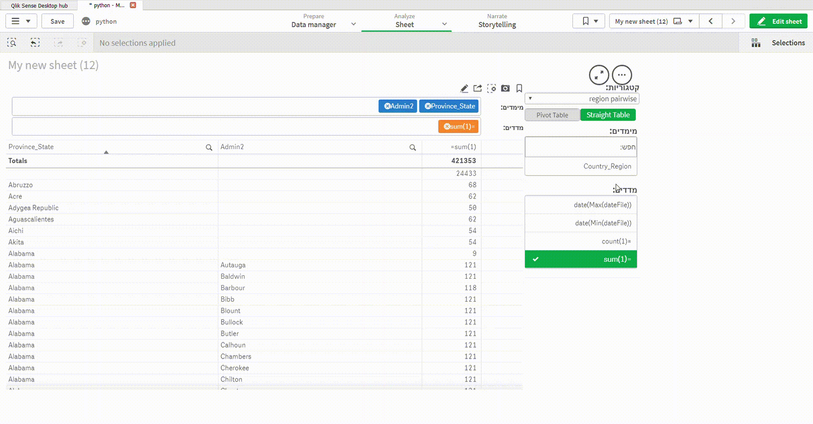

# qsCustomReport
customize qsCustomReport

qustomize extension that allows sub categories imported from master tables

the extension changed to right to left orientation

also added feature for save layout by bookmark

# examples:
**drag and drop**

**sub category by master tables**

**save report state by bookmark**

